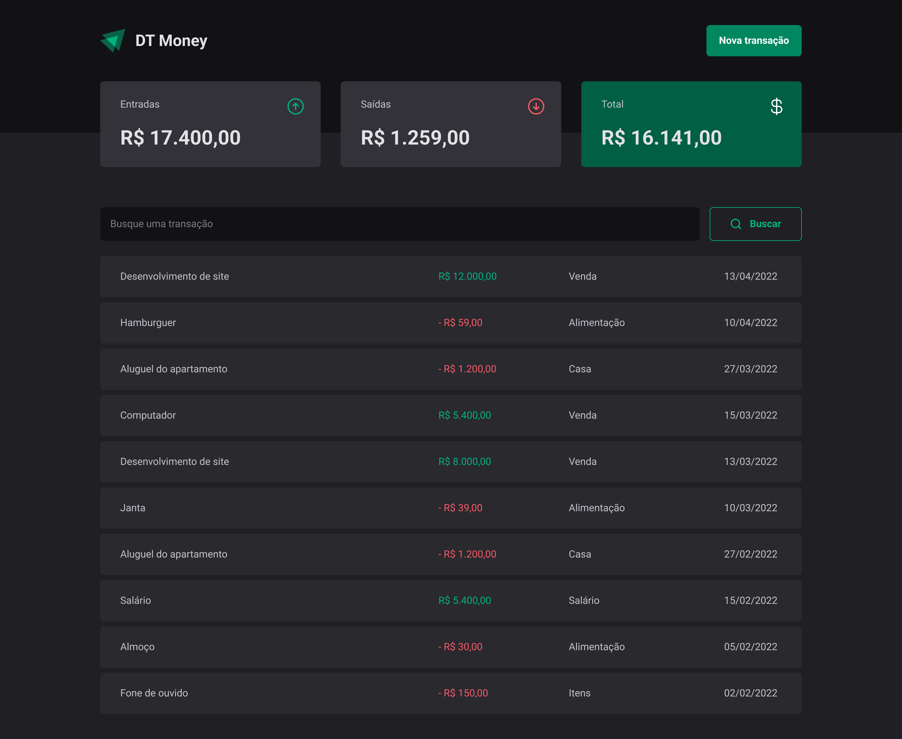
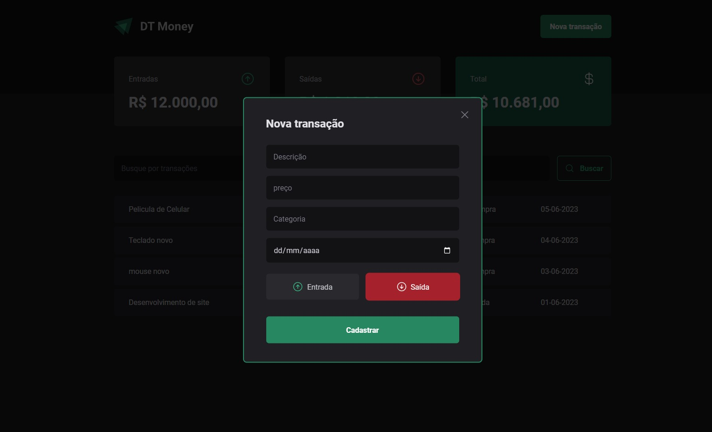

<h1 align='center'>DT Money</h1>

<h2 align='center'>💻 Projeto</h2>

Aplicação de gerencimanto de finanças

<h2 align='center'>⚙ Tecnologias </h2>

  
  
formulario com react-hook-form, zod e radix-ui

  

<h4 align='center'>Home Page</h4>

<h4 align='center'>New transaction modal</h4>

